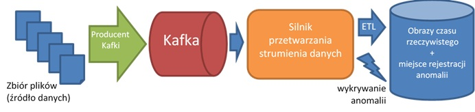

# Projekt 2 - Narzędzia Big Data

## Wprowadzenie

W ramach projektu dotyczącego narzędzi Big Data wykorzystywanych do przetwarzania strumieni danych każda osoba ma przyporządkowany:

- zestaw danych
- silnik (narzędzie) ze wskazanym typem API

## Opis ogólny projektu

W ramach projektu należy samodzielnie zaimplementować rozwiązanie dokonujące przetwarzania strumieni danych
w oparciu o:

- brokera wiadomości Kafka oraz
- określony silnik przetwarzania strumieni danych wykorzystywany w środowiskach Big Data, a także
- wybrane miejsce docelowe.

Dostępne silniki (poziomy API) przetwarzania strumieni danych:

- Spark Structured Streaming
- Kafka Streaming
- Flink (DataStream API)

### Architektura rozwiązania 



### Opis
Dane źródłowe w naszym rozwiązaniu będą miały postać zbioru plików (do 100) dostępnych w jednym z katalogów.

Producent Kafki (zaimplementowany w ramach jednego z zestawów zadań) będzie odczytywał zawartość kolejnych plików z tego zbioru i wysyłał je, linia po linii, do brokera Kafki symulując w ten sposób zachodzenie zdarzeń w świecie rzeczywistym.

Twoim zadaniem będzie implementacja rozwiązania, które będzie:

- odczytywało dane z serwera Kafki
- utrzymywało na podstawie tych danych wyniki pewnych obliczeń (agregacji) – obraz czasu rzeczywistego (*ETL*)
- reagowało na zachodzące "anomalie" rejestrując ich wystąpienia

Ponadto, konieczne będzie wybranie oraz wykorzystanie właściwego (ze względu na własności) miejsca przechowywania obrazów czasu rzeczywistego oraz miejsca rejestracji anomalii. W obu przypadkach może to być to samo lub różne miejsce.

Uwzględniając fakt, że na platformie *Dataproc* dostępne jest środowisko *Docker* (podobnie jak w lokalnych konfiguracjach), daje to praktycznie nieograniczone możliwości. 

Należy wziąć pod uwagę, że nie każda z platform przetwarzania strumieni danych posiada odpowiednie złącza (*connector*) do każdego miejsca docelowego. 

Aplikacja podczas utrzymywania wyników obliczeń (*ETL*) ma działać w dwóch trybach w zależności od parametru programu `delay`.

- W pierwszym (`delay=A`) program ma dostarczać dane do obrazu czasu rzeczywistego z najmniejszym możliwym opóźnieniem, nawet jeśli dostarczane wyniki nie są ostateczne i trzeba będzie je wielokrotnie aktualizować.
- W drugim (`delay=C`) program ma dostarczać dane do obrazu czasu rzeczywistego najszybciej jak się da, ale tylko wyniki ostateczne, tak aby nie było potrzeby ich późniejszej aktualizacji.

Ostateczna wersja programu ma mieć postać pliku jar (przy implementacji w Javie) lub skryptów (przy implementacji w Pythonie)

Oprócz samego programu należy dostarczyć: 

1. Skrypt tworzący źródłowe tematy *Kafki* i resetujący środowisko.<br>
Resetowanie środowiska powinno umożliwiać ponownie uruchomienie programu "od nowa". <br> 
Należy zatem zadbać o usunięcie i ponowne utworzenie tematów *Kafki*, miejsc składowania punktów kontrolnych oraz danych wykorzystywanych do wznawiania aplikacji *Kafka Streams* po awarii.
2. Skrypt i ewentualnie program zasilający źródłowe tematy *Kafki*
3. Program przetwarzania strumieni danych utrzymujący obraz czasu rzeczywistego oraz wyliczający anomalie (wspomniany wyżej)
4. Skrypt uruchamiający program przetwarzania strumieni danych
5. Skrypt przygotowujący miejsce docelowe dla obrazu czasu rzeczywistego oraz dostarczania alertów po wykryciu anomalii
6. Skrypt odczytujący wyniki z miejsca docelowego
7. Sprawozdanie, które ma mieć charakter szczegółowych instrukcji dla osób korzystających z powyższych skryptów. Uwzględnij fakt, że kwestie oczywiste dla Ciebie nie muszą być oczywiste dla innych. Zadbaj o szczegóły i wyjaśnienia.

## Platforma uruchomieniowa 

Projekty muszą być zaimplementowane i możliwe do uruchomienia w jednym z wybranych miejsc:
- platforma `Dataproc` 
- lokalna platforma `Docker` oparta na jednej ze wskazanych w sprawozdaniu konfiguracji opisanej w zestawach zadań

Konieczne jest, aby w sprawozdaniu opisać sposób przygotowania platformy uruchomieniowej/testowej, a następnie jej użycia przy uruchamianiu poszczególnych komponentów projektu.

## Sposoby uruchomienia 

W zależności od wykorzystywanego w ramach projektu silnika wymagane są różne sposoby obsługi końcowych projektów 

- Dla *Spark Structured Streaming* projekty muszą być możliwe do uruchomienia na klastrze Hadoop jako aplikacja YARN
```
spark-submit ... 
```
- Dla *Kafka Streams* projekty muszą być możliwe do uruchomienia na klastrze *Apache Kafka*
```
java -cp ...
```
- Dla *Apache Flink* projekty mogą być uruchamiane w jednym z trzech wariantów 
    - na klastrze Hadoop jako aplikacja YARN `./bin/flink run -t yarn-application`
    - na klastrze Flinka (*standalone*) `./bin/flink run`
    - w środowisku lokalnym `./bin/flink run -target local` (uwzględniając uruchamianie w ramach środowiska IDE) - ta opcja dostępna jest tylko w przypadku projektów implementowanych w Pythonie 

## Źródłowe zbiory danych
Wszystkie zbiory danych pobieramy z miejsca wskazanego na stronie kursu, niezależnie od ich oryginalnego źródła pochodzenia. 


## Kilka wskazówek
1. Nie uruchamiaj początkowych wersji programów na pełnym zbiorze danych. Postaraj się sprawdzić swoje rozwiązania na próbce danych, najlepiej tak przygotowanej aby znać oczekiwane wyniki i móc je porównać.<br>
Dopiero kiedy Twój program będzie gotowy, przetestuj go na pełnym wolumenie danych.
2. Twórz kolejne wersje programów zwiększając stopniowo używane w nim konstrukcje. Rozpocznij od przepisywania danych z tematu wynikowego do prostego ujścia (np. na konsolę). Jeśli to działa, wprowadzaj kolejno poszczególne
transformacje cały czas mając wszystko pod kontrolą.
3. Rozpocznij tworzenie Twojego rozwiązania od zasilania wejściowego tematu "z konsoli", mając pod kontrolą dostarczanie każdej wiadomości, obserwując po każdej z nich to co dostajesz na wyjściu.

## Opisy zestawów danych

- [Zestaw 1 – Netflix-Prize-Data](./Zestaw1–NetflixPrizeData/)
- [Zestaw 2 - NYC-Yellow-Taxi](./Zestaw2-NYC-Yellow-Taxi/)
- [Zestaw 3 - Crimes-in-Chicago](./Zestaw3-Crimes-in-Chicago/)
- [Zestaw 4 - Stock-Data](./Zestaw4-Stock-Data/)
- [Zestaw 5 - Chicago-Bicycle-Sharing](./Zestaw5-Chicago-Bicycle-Sharing/)
- [Zestaw 6 - US-Flights](./Zestaw6-US-Flights/)

## Punktacja projektu

<table border="0" cellspacing="0" cellpadding="0">
    <tbody>
        <tr>
            <td width="144" valign="top">
                <p><strong>Kryterium</strong></p>
            </td>
            <td width="159" valign="top">
                <p><strong>Poziom 0</strong></p>
            </td>
            <td width="202" valign="top">
                <p><strong>Poziom 1</strong></p>
            </td>
            <td width="123" valign="top">
                <p><strong>Poziom 2</strong></p>
            </td>
            <td width="69" valign="top">
                <p><strong>Liczba punktów</strong></p>
            </td>
        </tr>
        <tr>
            <td width="144" valign="top">
                <p><strong>Producent; skrypt zasilający</strong></p>
            </td>
            <td width="159" valign="top">
                <p>Brak, lub fundamentalne błędy uniemożliwiające działanie</p>
            </td>
            <td width="202" valign="top">
                <p>Drobne błędy uniemożliwiające działanie, lub działanie jest możliwe ale
                    niepoprawne</p>
            </td>
            <td width="123" valign="top">
                <p>Ideał, spójny z resztą projektu</p>
            </td>
            <td width="69" valign="top">
                <p align="right">2</p>
            </td>
        </tr>
        <tr>
            <td width="144" valign="top">
                <p><strong>Utrzymanie obrazu czasu rzeczywistego – transformacje </strong></p>
            </td>
            <td width="159" valign="top">
                <p>Brak lub brak
                    spójności z tematem projektu lub fundamentalne błędy uniemożliwiające
                    działanie</p>
            </td>
            <td width="202" valign="top">
                <p>Drobne
                    błędy uniemożliwiające działanie, lub działanie jest możliwe ale niepoprawne</p>
            </td>
            <td width="123" valign="top">
                <p>Ideał,
                    spójny z tematem i resztą projektu</p>
            </td>
            <td width="69" valign="top">
                <p align="right">8</p>
            </td>
        </tr>
        <tr>
            <td width="144" valign="top">
                <p><strong>Utrzymanie obrazu czasu rzeczywistego – obsługa trybu A</strong></p>
            </td>
            <td width="159" valign="top">
                <p>Brak lub fundamentalne błędy</p>
            </td>
            <td width="202" valign="top">
                <p>Drobne błędy</p>
            </td>
            <td width="123" valign="top">
                <p>Ideał</p>
            </td>
            <td width="69" valign="top">
                <p align="right">4</p>
            </td>
        </tr>
        <tr>
            <td width="144" valign="top">
                <p><strong>Utrzymanie obrazu czasu rzeczywistego – obsługa trybu C</strong></p>
            </td>
            <td width="159" valign="top">
                <p>Brak lub
                    fundamentalne błędy</p>
            </td>
            <td width="202" valign="top">
                <p>Drobne
                    błędy</p>
            </td>
            <td width="123" valign="top">
                <p>Ideał</p>
            </td>
            <td width="69" valign="top">
                <p align="right">4</p>
            </td>
        </tr>
        <tr>
            <td width="144" valign="top">
                <p><strong>Wykrywanie anomalii</strong></p>
            </td>
            <td width="159" valign="top">
                <p>Brak lub brak spójności z tematem projektu lub fundamentalne błędy
                    uniemożliwiające działanie</p>
            </td>
            <td width="202" valign="top">
                <p>Drobne błędy uniemożliwiające działanie, lub działanie jest możliwe ale
                    niepoprawne</p>
            </td>
            <td width="123" valign="top">
                <p>Ideał, spójny z tematem i resztą projektu</p>
            </td>
            <td width="69" valign="top">
                <p align="right">8</p>
            </td>
        </tr>
        <tr>
            <td width="144" valign="top">
                <p><strong>Program przetw. strumienia danych; jar</strong></p>
            </td>
            <td width="159" valign="top">
                <p>Brak</p>
            </td>
            <td width="202" valign="top">
                <p>Istnieje,
                    występują problemy z jego użyciem</p>
            </td>
            <td width="123" valign="top">
                <p>Ideał,
                    spójny z resztą projektu</p>
            </td>
            <td width="69" valign="top">
                <p align="right">4</p>
            </td>
        </tr>
        <tr>
            <td width="144" valign="top">
                <p><strong>Program przetw. danych; skrypt uruchamiający</strong></p>
            </td>
            <td width="159" valign="top">
                <p>Brak</p>
            </td>
            <td width="202" valign="top">
                <p>Istnieje, występują problemy z jego użyciem</p>
            </td>
            <td width="123" valign="top">
                <p>Ideał, spójny z resztą projektu</p>
            </td>
            <td width="69" valign="top">
                <p align="right">2</p>
            </td>
        </tr>
        <tr>
            <td width="144" valign="top">
                <p><strong>Miejsce utrzymywania obrazów czasu
                        rzeczywistego – skrypt tworzący</strong></p>
            </td>
            <td width="159" valign="top">
                <p>Brak lub
                    fundamentalne błędy uniemożliwiające działanie</p>
            </td>
            <td width="202" valign="top">
                <p>Istnieje,
                    występują problemy z jego użyciem</p>
            </td>
            <td width="123" valign="top">
                <p>Ideał,
                    spójny z resztą projektu</p>
            </td>
            <td width="69" valign="top">
                <p align="right">2</p>
            </td>
        </tr>
        <tr>
            <td width="144" valign="top">
                <p><strong>Miejsce utrzymywania obrazów czasu rzeczywistego
                        – cechy</strong></p>
            </td>
            <td width="159" valign="top">
                <p>Brak użycia</p>
            </td>
            <td width="202" valign="top">
                <p>Istnieje, występują problemy z jego użyciem i/lub jego cechy nie są
                    adekwatne </p>
            </td>
            <td width="123" valign="top">
                <p>Ideał, spójny z resztą projektu</p>
            </td>
            <td width="69" valign="top">
                <p align="right">4</p>
            </td>
        </tr>
        <tr>
            <td width="144" valign="top">
                <p><strong>Konsument: skrypt odczytujący wyniki przetwarzania</strong></p>
            </td>
            <td width="159" valign="top">
                <p>Brak lub
                    fundamentalne błędy uniemożliwiające działanie</p>
            </td>
            <td width="202" valign="top">
                <p>Drobne
                    błędy uniemożliwiające działanie, lub działanie jest możliwe ale niepoprawne</p>
            </td>
            <td width="123" valign="top">
                <p>Ideał,
                    spójny z resztą projektu</p>
            </td>
            <td width="69" valign="top">
                <p align="right">2</p>
            </td>
        </tr>
        <tr>
            <td width="144" valign="top">
                <p><strong>&nbsp;</strong></p>
            </td>
            <td width="159" valign="top">
                <p>&nbsp;</p>
            </td>
            <td width="202" valign="top">
                <p>&nbsp;</p>
            </td>
            <td width="123" valign="top">
                <p>Razem</p>
            </td>
            <td width="69" valign="top">
                <p align="right">40</p>
            </td>
        </tr>
    </tbody>
</table>